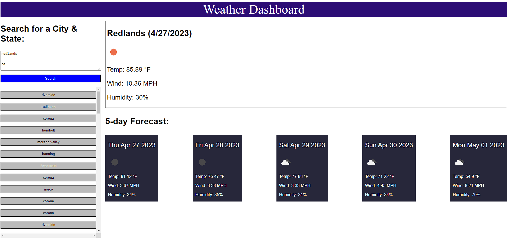

# Five Day Forecast

## Description
This application will provide you with weather data for the current day, as well as the following five days. 

Follow the lihnk below to view the deployed application

[Five Day Forecast](https://mrbll48.github.io/five-day-forecast)

## Screenshot

## Usage
The user can input a city and state that they would like to get weather data for, and the information will populate on the right side of the screen. Once a search has been made a button will appear that can be clicked to redo that search in the future. 

## Credits
Erik Hirsch: Program TA

## License
MIT